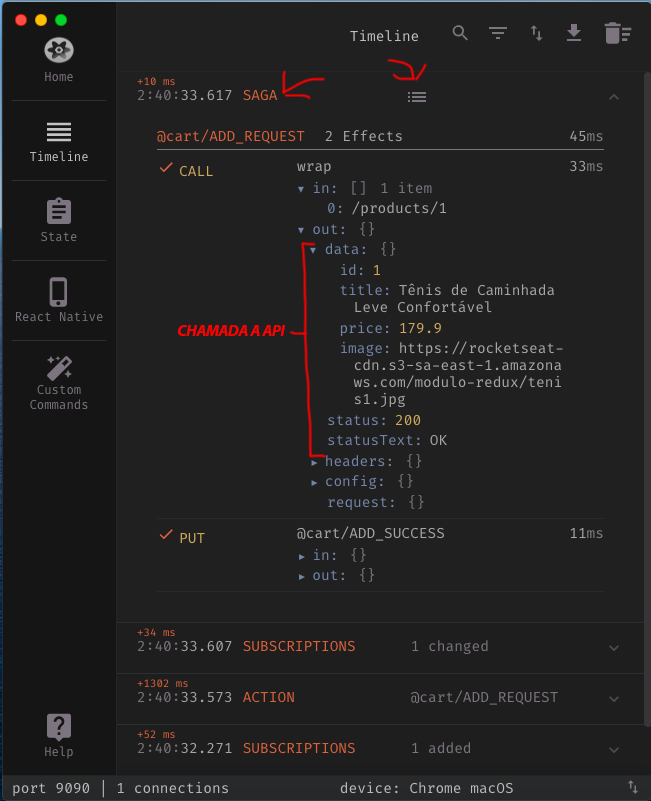

<h1>React com redux parte 11 - Adicionar plugin no reactotron do saga</h1>

- Instalação:

```bash
yarn add reactotron-redux-saga
```

- No arquivo de configuração do reactotron `src/config/ReactotronConfig.js` alterar para:

```js
import Reactotron from 'reactotron-react-js';
import { reactotronRedux } from 'reactotron-redux';
import reactotronSaga from 'reactotron-redux-saga';

if (process.env.NODE_ENV === 'development') {
  const tron = Reactotron.configure()
    .use(reactotronRedux())
    .use(reactotronSaga)
    .connect();

  tron.clear();

  console.tron = tron;
}

```

- No arquivo `src/store/index.js` alterar para:

```js
import { createStore, applyMiddleware, compose } from 'redux';
import createSagaMiddleware from 'redux-saga';

import rootSaga from './modules/rootSaga';

import rootReducer from './modules/rootReducer';

const sagaMonitor =
  process.env.NODE_ENV === 'development'
    ? console.tron.createSagaMonitor()
    : null;
const sagaMiddleware = createSagaMiddleware({ sagaMonitor });

const enhancer =
  process.env.NODE_ENV === 'development'
    ? compose(console.tron.createEnhancer(), applyMiddleware(sagaMiddleware))
    : applyMiddleware(sagaMiddleware);

const store = createStore(rootReducer, enhancer);

sagaMiddleware.run(rootSaga);

export default store;

```


